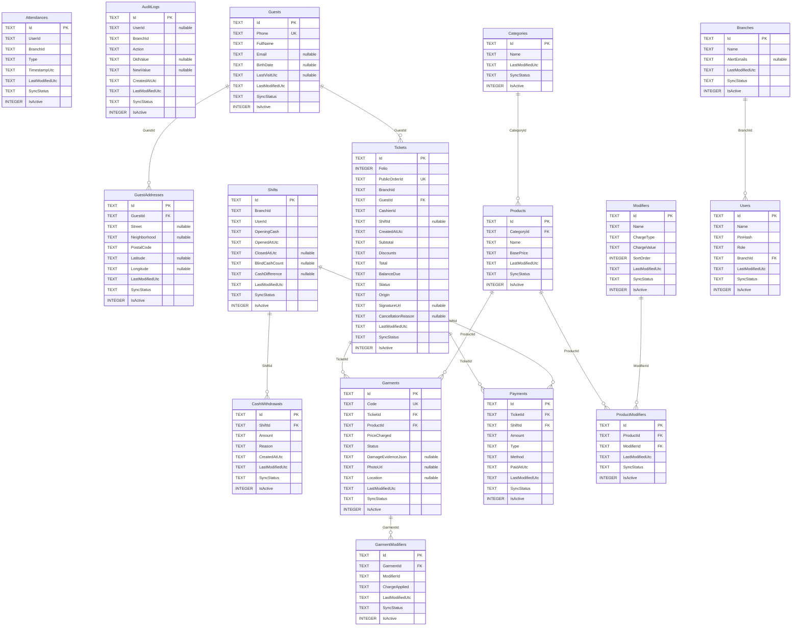

# Database diagram

Generated from the real database by `python3 tools/db_diagram.py`. Do not edit by hand.

Reading the lines: `||--o{` = one to many; `|o--o{` = optional (nullable FK).

```mermaid
erDiagram
    Attendances {
        TEXT Id PK
        TEXT UserId
        TEXT BranchId
        TEXT Type
        TEXT TimestampUtc
        TEXT LastModifiedUtc
        TEXT SyncStatus
        INTEGER IsActive
    }
    AuditLogs {
        TEXT Id PK
        TEXT UserId "nullable"
        TEXT BranchId
        TEXT Action
        TEXT OldValue "nullable"
        TEXT NewValue "nullable"
        TEXT CreatedAtUtc
        TEXT LastModifiedUtc
        TEXT SyncStatus
        INTEGER IsActive
    }
    Branches {
        TEXT Id PK
        TEXT Name
        TEXT AlertEmails "nullable"
        TEXT LastModifiedUtc
        TEXT SyncStatus
        INTEGER IsActive
    }
    CashWithdrawals {
        TEXT Id PK
        TEXT ShiftId FK
        TEXT Amount
        TEXT Reason
        TEXT CreatedAtUtc
        TEXT LastModifiedUtc
        TEXT SyncStatus
        INTEGER IsActive
    }
    Categories {
        TEXT Id PK
        TEXT Name
        TEXT LastModifiedUtc
        TEXT SyncStatus
        INTEGER IsActive
    }
    GarmentModifiers {
        TEXT Id PK
        TEXT GarmentId FK
        TEXT ModifierId
        TEXT ChargeApplied
        TEXT LastModifiedUtc
        TEXT SyncStatus
        INTEGER IsActive
    }
    Garments {
        TEXT Id PK
        TEXT Code UK
        TEXT TicketId FK
        TEXT ProductId FK
        TEXT PriceCharged
        TEXT Status
        TEXT DamageEvidenceJson "nullable"
        TEXT PhotoUrl "nullable"
        TEXT Location "nullable"
        TEXT LastModifiedUtc
        TEXT SyncStatus
        INTEGER IsActive
    }
    GuestAddresses {
        TEXT Id PK
        TEXT GuestId FK
        TEXT Street "nullable"
        TEXT Neighborhood "nullable"
        TEXT PostalCode
        TEXT Latitude "nullable"
        TEXT Longitude "nullable"
        TEXT LastModifiedUtc
        TEXT SyncStatus
        INTEGER IsActive
    }
    Guests {
        TEXT Id PK
        TEXT Phone UK
        TEXT FullName
        TEXT Email "nullable"
        TEXT BirthDate "nullable"
        TEXT LastVisitUtc "nullable"
        TEXT LastModifiedUtc
        TEXT SyncStatus
        INTEGER IsActive
    }
    Modifiers {
        TEXT Id PK
        TEXT Name
        TEXT ChargeType
        TEXT ChargeValue
        INTEGER SortOrder
        TEXT LastModifiedUtc
        TEXT SyncStatus
        INTEGER IsActive
    }
    Payments {
        TEXT Id PK
        TEXT TicketId FK
        TEXT ShiftId FK
        TEXT Amount
        TEXT Type
        TEXT Method
        TEXT PaidAtUtc
        TEXT LastModifiedUtc
        TEXT SyncStatus
        INTEGER IsActive
    }
    ProductModifiers {
        TEXT Id PK
        TEXT ProductId FK
        TEXT ModifierId FK
        TEXT LastModifiedUtc
        TEXT SyncStatus
        INTEGER IsActive
    }
    Products {
        TEXT Id PK
        TEXT CategoryId FK
        TEXT Name
        TEXT BasePrice
        TEXT LastModifiedUtc
        TEXT SyncStatus
        INTEGER IsActive
    }
    Shifts {
        TEXT Id PK
        TEXT BranchId
        TEXT UserId
        TEXT OpeningCash
        TEXT OpenedAtUtc
        TEXT ClosedAtUtc "nullable"
        TEXT BlindCashCount "nullable"
        TEXT CashDifference "nullable"
        TEXT LastModifiedUtc
        TEXT SyncStatus
        INTEGER IsActive
    }
    Tickets {
        TEXT Id PK
        INTEGER Folio
        TEXT PublicOrderId UK
        TEXT BranchId
        TEXT GuestId FK
        TEXT CashierId
        TEXT ShiftId "nullable"
        TEXT CreatedAtUtc
        TEXT Subtotal
        TEXT Discounts
        TEXT Total
        TEXT BalanceDue
        TEXT Status
        TEXT Origin
        TEXT SignatureUrl "nullable"
        TEXT CancellationReason "nullable"
        TEXT LastModifiedUtc
        TEXT SyncStatus
        INTEGER IsActive
    }
    Users {
        TEXT Id PK
        TEXT Name
        TEXT PinHash
        TEXT Role
        TEXT BranchId FK
        TEXT LastModifiedUtc
        TEXT SyncStatus
        INTEGER IsActive
    }

    Shifts ||--o{ CashWithdrawals : "ShiftId"
    Garments ||--o{ GarmentModifiers : "GarmentId"
    Tickets ||--o{ Garments : "TicketId"
    Products ||--o{ Garments : "ProductId"
    Guests ||--o{ GuestAddresses : "GuestId"
    Tickets ||--o{ Payments : "TicketId"
    Shifts ||--o{ Payments : "ShiftId"
    Products ||--o{ ProductModifiers : "ProductId"
    Modifiers ||--o{ ProductModifiers : "ModifierId"
    Categories ||--o{ Products : "CategoryId"
    Guests ||--o{ Tickets : "GuestId"
    Branches ||--o{ Users : "BranchId"
```
